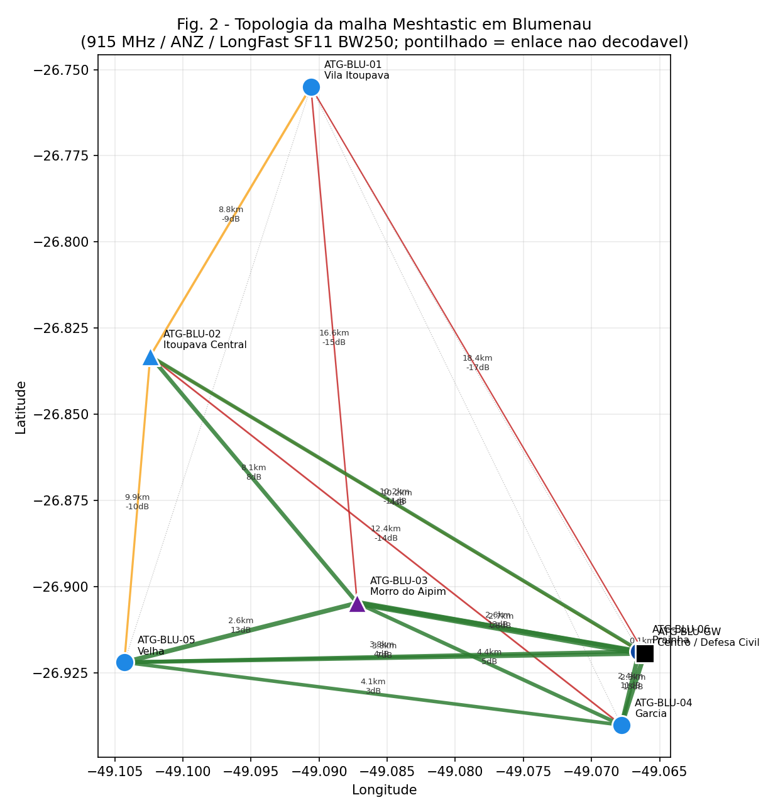
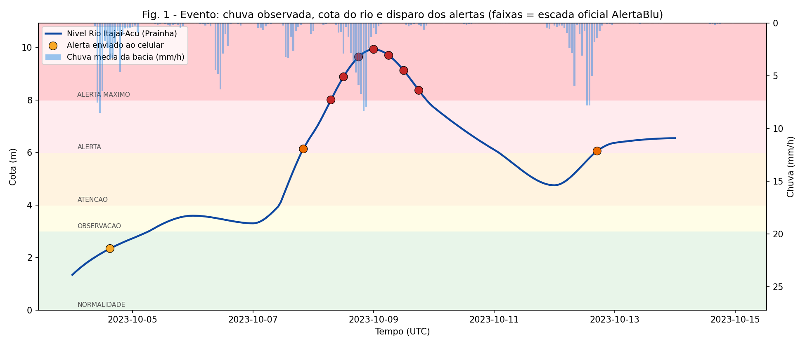
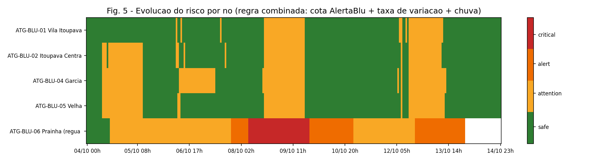
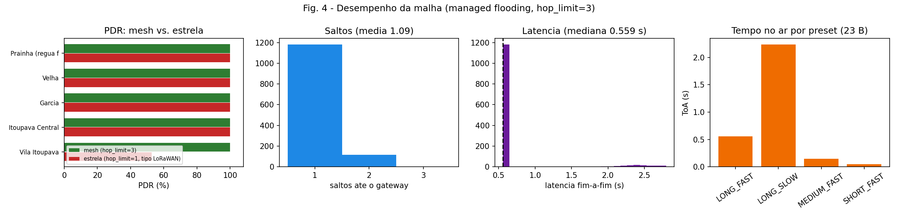

# Americas TechGuard — Período 8
## Integração LoRa/Meshtastic, JSON e alertas ambientais para dispositivos móveis

**Rosemeri Borges** — Centro Universitário SENAI/SC, Campus Florianópolis 

Orientação: Prof. Valério Piana · Prof. Lucas Lacerda · Prof. Alex Salazar

Período: 08/07/2026 – 18/07/2026 · Eixo: Sistemas Embarcados, LoRa, Meshtastic, LoRaWAN, JSON, IoT

**Trilha escolhida: B — software-only / simulação**, com o firmware ESP32 e a configuração de rádio já escritos para a Trilha A (ver [`hardware/`](hardware/)). Estou no Paraná; o hardware está em Joinville. Nada aqui depende de placa, mas tudo foi feito para encaixar na placa sem reescrita, o payload de fio produzido pelo `.ino` é decodificado byte a byte pelo código Python.

---

## O que este repositório entrega

Uma cadeia mínima de alerta ambiental completa e executável para Blumenau:

`chuva e vazão observadas → payload JSON ATG-ENV 1.0 → validação → regra de risco (escada oficial da Defesa Civil) → codec compacto → malha Meshtastic → gateway → MQTT/JSON → mensagem no celular`

O pipeline foi executado sobre a **sequência de cheias de outubro de 2023**, o outubro mais chuvoso da história de Blumenau. Não escolhi o evento: o script varreu 2023–2025 e selecionou automaticamente o maior pico de vazão.

### Três resultados

**1. O JSON legível não passa pelo rádio.** O payload canônico ATG-ENV tem **669 B** minificado. O `Data.payload` do Meshtastic aceita **233 B**. Foi preciso projetar um formato de fio: **ATG-C1-BIN, 23 bytes** — 29× menor, sem perda de informação útil.

**2. O mesh não é enfeite.** Em topologia estrela (o que o LoRaWAN de Zakaria et al. faz), o nó de Vila Itoupava — 18,4 km do gateway, entrega **52,7%** dos pacotes. Com managed flooding a 3 saltos, entrega **100%**. PDR global: 90,4% → 100%.

**3. A cota derivada bateu com a cheia real.** O mapeamento vazão→cota, construído sobre 10.756 dias de climatologia e sem nunca ver o evento, produziu pico de **9,93 m**. O pico observado em Blumenau em outubro/2023 foi de **10,76 m**. Erro de **0,83 m** numa cheia de dez metros.

---

## Sumário

- [1. Estudo técnico dos artigos (ETAPA 1)](#1-estudo-técnico-dos-artigos-etapa-1)
- [2. Modelagem do payload JSON (ETAPA 2)](#2-modelagem-do-payload-json-etapa-2)
- [3. Implementação e arquitetura (ETAPA 3)](#3-implementação-e-arquitetura-etapa-3)
- [4. Integração com Meshtastic (ETAPA 4)](#4-integração-com-meshtastic-etapa-4)
- [5. Evidências, resultados e limitações (ETAPA 5)](#5-evidências-resultados-e-limitações-etapa-5)
- [6. Erros encontrados e como foram tratados](#6-erros-encontrados-e-como-foram-tratados)
- [7. Aplicação ao Americas TechGuard (ETAPA 6)](#7-aplicação-ao-americas-techguard-etapa-6)
- [Como reproduzir](#como-reproduzir)
- [Referências](#referências)

---

## 1. Estudo técnico dos artigos (ETAPA 1)

### 1.1 Artigo principal — LoRaWAN para monitoramento e aviso de inundação

> Zakaria, M. I.; Jabbar, W. A.; Sulaiman, N. **Development of a smart sensing unit for LoRaWAN-based IoT flood monitoring and warning system in catchment areas.** *Internet of Things and Cyber-Physical Systems*, v. 3, p. 249–261, 2023. DOI: [10.1016/j.iotcps.2023.04.005](https://doi.org/10.1016/j.iotcps.2023.04.005)

**Problema que o artigo resolve.** Os sistemas de monitoramento de cheias na Malásia são caros, complexos e têm defasagem de dados da ordem de **1 hora**: telemetria → agência → atualização manual do site. Os autores eliminam o intermediário conectando o sensor direto à nuvem por LoRaWAN, com alerta chegando ao celular do cidadão.

**Como sensores, conectividade de baixo consumo e plataformas IoT sustentam o alerta.** A unidade é um Arduino Uno + sensor ultrassônico **HC-SR04** (2–400 cm, ±3 mm) + LoRa Shield 915 MHz, alimentada por painel solar. O gateway é um Raspberry Pi 3 com HAT-LRGW-915, oito canais, integrado à **TTN**; de lá os dados sobem para **TagoIO** e **ThingSpeak**, que disparam SMS, chamada e alarme.

**O que reaproveitei do artigo:**

| Elemento do artigo | O que fiz com ele |
|---|---|
| **Algoritmo 1**: classifica por nível **e por taxa de variação** (cm/min) | Reaproveitado como núcleo do motor de risco (`risk.py`), mas com a taxa em **cm/h**, a escala útil de um rio de porte, não de um canal urbano |
| 4 níveis de risco (safe / alert / cautious / dangerous) | **Adaptado**: em vez dos limiares de bancada (50/100/150 cm), uso a **escada oficial do AlertaBlu** (3/4/6/8 m) |
| Eq. 1 e 2: `D(t)=t·Cs/2`, `Nível = Dmax − D(t)` | Implementadas literalmente no firmware ESP32 (`hardware/esp32_atg_node/atg_node.ino`) |
| Métricas RSSI, SNR, PDR e atraso (SF7 vs SF12) | São exatamente as métricas que o simulador de malha reporta |
| Período de transmissão fixo de 60 s | **Melhorado**: reporte **adaptativo ao risco** (60 min em calmaria → 60 s em alerta máximo), para poupar bateria e *airtime* |
| Topologia **estrela** com gateway central | **Substituída** por mesh — e a comparação quantitativa entre as duas é um dos resultados desta entrega |

### 1.2 Referência complementar — Meshtastic mesh em campus inteligente

> Garzon Andosilla, R.; Rugeles, J. **A Meshtastic-based LoRa Mesh System for Smart Campus Applications: From Solar-Powered Sensing to Containerized Data Management.** arXiv:[2605.20379](https://arxiv.org/abs/2605.20379) [cs.NI], 2026.

**O que o artigo apresenta.** Arquitetura em **quatro camadas** (Percepção, Rede, Edge/Processamento, Aplicação) na Universidad Militar Nueva Granada. Quatro nós heterogêneos + um rastreador SenseCAP T1000-E. O nó 4 (RAK4631) é ao mesmo tempo participante da malha e cliente Wi-Fi: ele **traduz pacotes Meshtastic em MQTT/JSON**, dispensando gateway e servidor de rede LoRaWAN. No *edge*, um stack Docker Compose: Mosquitto (1883) → Node-RED (1880) → InfluxDB (8086) → Grafana (3000). Resultado de campo: enlace decodável a **2,47 km**, RSSI médio **−110 dBm**, SNR **+2,75 dB**, com apenas 68 m de vantagem de elevação.

**O que reaproveitei:**

- A **arquitetura de 4 camadas** é a espinha do meu pipeline (§3).
- O **padrão do nó-ponte** (LoRa ↔ Wi-Fi ↔ MQTT/JSON) é o que o meu gateway `ATG-BLU-GW` faz.
- O comportamento do **managed flooding** (cache de ID, back-off inversamente proporcional ao SNR, `hop_limit`) foi implementado em `mesh_sim.py`.
- A medida de 2,47 km serve como **ponto de validação** do meu modelo de propagação (§5.4) não de ajuste: o modelo é um log-distância padrão e *acerta* a medida com erro de 0,6 dB.
- A hipótese do **repetidor em ponto elevado** virou o nó `ATG-BLU-03` no Morro do Aipim.

**Divergência que encontrei.** O artigo afirma que o preset *LongFast* corresponde a SF11 **@ 125 kHz**. A documentação oficial do Meshtastic define *LongFast* como SF11 **@ 250 kHz**, CR 4/5. Adotei o **valor oficial** e registro aqui a divergência, ela muda o tempo no ar por um fator ~2 e, portanto, todo o cálculo de *duty cycle*.

### 1.3 LoRa × LoRaWAN × Meshtastic — e onde isso apareceu no código

| | **LoRa** | **LoRaWAN** | **Meshtastic** |
|---|---|---|---|
| O que é | Modulação CSS na camada física | Protocolo MAC + arquitetura de rede | Firmware/aplicação open-source sobre LoRa |
| Topologia | — | **Estrela**: nó → gateway → servidor | **Mesh** descentralizado |
| Roteamento | — | Nenhum (1 salto) | **Managed flooding** com cache de ID e `hop_limit` |
| Precisa de infraestrutura? | — | Sim: gateway + network server | **Não** — funciona off-grid |
| Segurança | — | NwkSKey + AppSKey (OTAA/ABP) | AES-CTR por canal (PSK), sem contador de frames |
| Chega ao celular | Via nuvem/SMS | Via nuvem/SMS | **Direto, por Bluetooth, pelo app Meshtastic** |

**Meshtastic não é LoRaWAN.** Os dois usam LoRa; só isso. Onde a distinção apareceu na implementação:

1. **Não** existe *join*, DevEUI, AppKey ou *network server* neste repositório — se existisse, seria LoRaWAN travestido.
2. O `hop_limit=3` e o cache de duplicatas são **específicos do Meshtastic** e estão em `mesh_sim.py`.
3. Rodei a **mesma física** com `hop_limit=1` para obter um baseline *equivalente a LoRaWAN* — é assim que a comparação de PDR (§5.3) é honesta.
4. O LoRaWAN entra como **referência arquitetural**: a cadeia *sensor → risco → dashboard → alerta* de Zakaria et al. é a que reproduzo; só troquei o transporte.

---

## 2. Modelagem do payload JSON (ETAPA 2)

### 2.1 ATG-ENV 1.0 — o formato 

Schema completo (JSON Schema draft 2020-12): [`examples/atg-env-1.0.schema.json`](examples/atg-env-1.0.schema.json)
Implementação: [`src/atg_mesh/schema.py`](src/atg_mesh/schema.py)

Exemplo real, extraído de `outputs/payloads.jsonl` (09/10/2023, pico da cheia):

```json
{
  "schema": "atg-env/1.0",
  "device_id": "!a76c0006",
  "node_num": 2808872966,
  "node_name": "ATG-BLU-06 Prainha (regua fluviometrica)",
  "timestamp": "2023-10-09T00:00:00Z",
  "latitude": -26.9187,
  "longitude": -49.0665,
  "altitude": 12.0,
  "site": "Prainha",
  "sensor_type": "river_level",
  "sensor_value": 9.928,
  "unit": "m",
  "rate_of_change": 0.009,
  "accum_24h_mm": 50.9,
  "risk_level": "critical",
  "alertablu_stage": "alerta_maximo",
  "alert_message": "[ATG-BLU] ALERTA MAXIMO: Rio Itajai-Acu 9.93m (estavel) em Prainha. Cota 1as vias 7.4m. Deixe areas de risco AGORA. Procure ponto alto/abrigo. Emerg 199/193. 08/10 21:00",
  "source": "glofas_openmeteo",
  "quality": "ok",
  "battery_pct": 78,
  "fw": "atg-node/1.0",
  "radio": { "rssi_dbm": null, "snr_db": null, "hops": null, "preset": "LONG_FAST", "region": "ANZ" }
}
```

Os **10 campos mínimos** exigidos pelo enunciado estão todos presentes. Os campos extras existem por necessidade concreta:

| Campo extra | Por que existe |
|---|---|
| `node_num` | O envelope JSON do Meshtastic usa o Node ID em **decimal** no campo `from`; o `device_id` é o hexadecimal. Carregar os dois evita conversão no gateway |
| `rate_of_change` | É metade do Algoritmo 1 de Zakaria et al. Sem ele, o alerta chega tarde |
| `alertablu_stage` | O enum de 4 níveis (`safe/attention/alert/critical`) **perde informação**: a Defesa Civil de Blumenau usa **5** estágios. Preservo os dois |
| `radio` | RSSI/SNR/saltos preenchidos **pelo gateway** na recepção — são as métricas dos dois artigos |
| `quality` | `ok` / `stale` / `out_of_range`, para o consumidor não confundir "sem dado" com "dado zero" |
| `schema` | Versionamento explícito: payloads v1.0 e v2.0 vão coexistir na malha durante qualquer migração |

### 2.2 Validação e tratamento de erros

`src/atg_mesh/validator.py` faz três camadas de checagem:

1. **Desserialização** — JSON malformado retorna erro nomeado, não *stack trace*.
2. **JSON Schema** — campos mínimos, tipos, enums, faixas, tamanho da mensagem.
3. **Regras semânticas que o schema não pega:**
   - `timestamp` ISO 8601 **com timezone** (sem offset → rejeitado);
   - coordenada dentro da **bounding box do Vale do Itajaí** (guarda contra nó mal configurado ou *spoofing* de posição);
   - `sensor_value` dentro da faixa plausível do tipo de sensor (teto do nível do rio: 20 m, a cheia recorde de 1911 em Blumenau foi 16,90 m);
   - coerência `unit` × `sensor_type`.

**Payload que não passa no schema não entra na malha.** Um nó de campo com leitura inválida deve ficar em silêncio, nunca transmitir lixo que o gateway interpretaria como risco. Os rejeitados vão para `outputs/payloads_rejeitados.jsonl`. Esta regra nasceu de um erro real (§6.3).

Sete payloads inválidos e as mensagens de erro exatas que produzem estão em [`examples/payloads_invalidos_e_erros.json`](examples/payloads_invalidos_e_erros.json) e são cobertos por testes.

### 2.3 ATG-C1 — o formato de fio (e por que precisou existir)

**Este é o ponto central da atividade.** O ATG-ENV é ótimo para API, banco e dashboard, mas **não cabe no rádio**:


| Representação | Bytes | Cabe em 233 B? |
|---|---|---|
| `atg-env/1.0` (JSON indentado) | **791** | não |
| `atg-env/1.0` (JSON minificado) | **669** | não |
| `ATG-C1-JSON` (chaves de 1 letra, inteiros escalados) | **98** | sim |
| **`ATG-C1-BIN`** (struct binário, `PRIVATE_APP`) | **23** | sim |
| `ATG-C1-B64` (dentro de um `TEXT_MESSAGE_APP`) | **32** | sim |
| `alert_message` (texto humano, pro celular) | **119** | sim |

O limite não é opinião: o firmware Meshtastic define `DATA_PAYLOAD_LEN = 233` B dentro de um pacote LoRa de no máximo 256 B (16 B de cabeçalho fora do envelope).

**Layout do ATG-C1-BIN (23 bytes, little-endian):**

```
off tam campo      codificação
 0   1  ver_type   nibble alto = versão (1) | nibble baixo = código do sensor
 1   4  node_num   uint32  — Node ID Meshtastic
 5   4  ts         uint32  — unix epoch
 9   4  lat_i      int32   — graus × 1e6  (≈ 0,11 m de resolução)
13   4  lon_i      int32   — graus × 1e6
17   2  val        int16   — escalado por tipo (nível: cm; chuva: 0,1 mm)
19   2  rate       int16   — taxa/hora × 1000
21   1  risk       uint8   — 0..3
22   1  batt       uint8   — 0..100 %
```

O `struct.pack("<BIIiihhBB", …)` do Python e a `struct atg_c1_t` do `.ino` são **bit a bit idênticos**  é assim que a trilha de software e a de hardware conversam sem adaptador.

O `alert_message` **não viaja pelo rádio**: ele é reconstruído no gateway a partir dos campos. Mandar 119 B de texto quando 23 B de dado bastam custaria 5× mais *airtime*.

---

## 3. Implementação e arquitetura (ETAPA 3)

Arquitetura em 4 camadas — a mesma da referência complementar, adaptada a alerta de cheia:

```
┌─ PERCEPÇÃO ────────────────────────────────────────────────────────────────┐
│  4 pluviômetros (chuva horária ERA5-Land observada)                        │
│  1 régua fluviométrica na Prainha (vazão GloFAS → cota)                    │
│  → ingest.py                                                               │
└──────────────────────────┬─────────────────────────────────────────────────┘
                           │  ATG-ENV 1.0 (JSON, 669 B)  → validator.py
                           │  risco: cota AlertaBlu + taxa + chuva → risk.py
                           │  mensagem ≤ 200 chars ASCII → alert.py
                           ▼  ATG-C1-BIN (23 B) → codec.py
┌─ REDE ─────────────────────────────────────────────────────────────────────┐
│  Malha Meshtastic 915 MHz / ANZ / LongFast (SF11, BW250, CR4/5)            │
│  managed flooding · cache de ID · back-off por SNR · hop_limit = 3         │
│  → mesh_sim.py  (física em lora.py: ToA Semtech + log-distância)           │
└──────────────────────────┬─────────────────────────────────────────────────┘
                           │  gateway ATG-BLU-GW (Defesa Civil)
                           ▼  re-hidrata ATG-C1 → ATG-ENV completo
┌─ EDGE / PROCESSAMENTO ─────────────────────────────────────────────────────┐
│  MQTT/JSON do Meshtastic → meshtastic_json.py                              │
│  uplink  : msh/BR/2/json/ATG-Blumenau/!a76c00ff   (telemetry | text)       │
│  downlink: msh/BR/2/json/mqtt/                    (sendtext)               │
│  (produção: Mosquitto → Node-RED → InfluxDB → Grafana, Docker Compose)     │
└──────────────────────────┬─────────────────────────────────────────────────┘
                           ▼
┌─ APLICAÇÃO ────────────────────────────────────────────────────────────────┐
│  Celular com o app Meshtastic (Bluetooth) · dashboard · Defesa Civil       │
└────────────────────────────────────────────────────────────────────────────┘
```

### 3.1 A malha, em Blumenau de verdade



| Nó | Local | Papel | Sensor | Coordenada | Antena |
|---|---|---|---|---|---|
| ATG-BLU-01 | Vila Itoupava | CLIENT | pluviômetro | −26,7550 / −49,0906 | 5 dBi |
| ATG-BLU-02 | Itoupava Central | **ROUTER** | pluviômetro | −26,8331 / −49,1024 | 5 dBi |
| ATG-BLU-03 | Morro do Aipim | **ROUTER** | repetidor | −26,9047 / −49,0872 | 8 dBi |
| ATG-BLU-04 | Garcia | CLIENT | pluviômetro | −26,9401 / −49,0678 | 5 dBi |
| ATG-BLU-05 | Velha | CLIENT | pluviômetro | −26,9219 / −49,1043 | 5 dBi |
| ATG-BLU-06 | Prainha | CLIENT | **nível do rio** | −26,9187 / −49,0665 | 5 dBi |
| ATG-BLU-GW | Centro / Defesa Civil | **GATEWAY** | — | −26,9194 / −49,0661 | 8 dBi |

O eixo Vila Itoupava → Centro tem **18,4 km**. Não é um número escolhido para ficar bonito: é a extensão real de Blumenau no sentido norte-sul, e é ela que torna a topologia estrela insuficiente.

### 3.2 Regra de risco (`risk.py`)

**(A) Cota absoluta — escada OFICIAL da Defesa Civil de Blumenau:**

| Cota (m) | Estágio oficial | `risk_level` |
|---|---|---|
| 0 – 3 | Normalidade | `safe` |
| 3 – 4 | Observação | `attention` |
| 4 – 6 | Atenção | `attention` |
| 6 – 8 | Alerta | `alert` |
| > 8 | Alerta Máximo | `critical` |

**(B) Taxa de variação** — escalona o risco. Âncora documentada: na cheia de 04/05/2022 o AlertaBlu registrou subida **média de ~25 cm/h** em Blumenau. Daí: `≥ 0,25 m/h` sobe 1 degrau; `≥ 0,40 m/h` sobe 2. No evento de outubro/2023 a subida chegou a **+0,24 m/h**.

**(C) Chuva — indicador antecedente, com teto em `attention`.** Os limiares vêm dos **percentis (p95/p99/p99.9) da climatologia ERA5-Land de 6 anos** nas 4 estações (210.432 amostras horárias), não de números inventados. Mas a chuva **não pode escalar sozinha para `alert` ou `critical`**: quem alaga Blumenau é o rio, não a chuva caindo no telhado. Só a cota do Itajaí-Açu chega lá.

Essa restrição não estava no projeto original, nasceu de um alarme falso encontrado na primeira execução real (§6.5).

**Risco final = pior caso entre (A escalonado por B) e (C).**

### 3.3 Reporte adaptativo (decisão técnica que economiza bateria)

| Risco | Intervalo | Duty cycle |
|---|---|---|
| `safe` | 60 min | 0,016 % |
| `attention` | 15 min | 0,062 % |
| `alert` | 5 min | 0,186 % |
| `critical` | 1 min | 0,932 % |

Com ToA de **0,559 s** por pacote (LongFast, 23 B), o duty cycle fica **abaixo de 1 % até no pior caso**, folgado em relação ao limite de 1 % que Zakaria et al. tiveram de respeitar na Malásia. Um nó em calmaria transmite 24 vezes por dia: **13 s de rádio ligado em 24 h**.

---

## 4. Integração com Meshtastic (ETAPA 4)

Implementação: [`src/atg_mesh/meshtastic_json.py`](src/atg_mesh/meshtastic_json.py)
Exemplos completos: [`examples/meshtastic_mqtt.json`](examples/meshtastic_mqtt.json) · Log real: [`outputs/mqtt_log.txt`](outputs/mqtt_log.txt)

**Uplink** (nó → broker), com `mqtt.json_enabled=true`:

```
tópico: msh/BR/2/json/ATG-Blumenau/!a76c00ff
{"channel":0,"from":2808872966,"id":1913880293,
 "payload":{"atg":"atg-env/1.0","sensor_type":"river_level","sensor_value":9.928,
            "unit":"m","risk_level":"critical","rate_of_change":0.009,
            "battery_level":78,"latitude_i":-269187000,"longitude_i":-490665000},
 "sender":"!a76c00ff","timestamp":1696809600,"to":4294967295,
 "type":"telemetry","rssi":-63.4,"snr":50.6,"hops_away":1}
```

**Downlink** (backend → malha → celular):

```
tópico: msh/BR/2/json/mqtt/
{"from":2808873215,"to":4294967295,"channel":0,"type":"sendtext",
 "payload":"[ATG-BLU] ALERTA MAXIMO: Rio Itajai-Acu 9.93m ..."}
```

Detalhes da documentação oficial que a implementação respeita e que **quebram na prática se ignorados**:

- O downlink só entra na malha se existir um canal chamado **literalmente `mqtt`**, com *downlink* habilitado. Caso contrário o firmware loga `JSON downlink received on channel not called 'mqtt'` e descarta.
- Campos **`from`** e **`payload`** são obrigatórios (o antigo `sender` deixou de ser, a partir do firmware 2.2.20).
- `to: 4294967295` é o endereço de **broadcast**.
- **JSON via MQTT não funciona em nRF52.** As três placas da atividade (T-Beam V1.1, Heltec V3, T3S3) são ESP32 → funciona.
- A mensagem de alerta é gerada em **ASCII puro**, sem acentos: acentos ocupam 2 bytes em UTF-8 e o firmware já teve bug documentado de *mangling* de UTF-8 no caminho JSON/MQTT (`meshtastic/firmware#3562`).

**Telemetria:** o protobuf `EnvironmentMetrics` do módulo Telemetry **não tem campo para nível de rio nem para chuva acumulada**. Por isso o ATG-ENV viaja no campo `payload` do envelope JSON, e não como telemetria nativa. É uma limitação real do ecossistema — e um candidato natural a um `PRIVATE_APP` próprio.

**Região do rádio.** A tabela oficial *LoRa Region by Country* lista o Brasil como `ANZ | BR_902`. `BR_902` opera em **902–907,5 MHz**. Como a atividade exige **915 MHz obrigatório**, a região correta é **`ANZ`** (915–928 MHz). Um nó em `BR_902` e outro em `ANZ` simplesmente não se enxergam — é o tipo de erro que só aparece no campo.

---

## 5. Evidências, resultados e limitações (ETAPA 5)

> Todos os números abaixo saem de [`outputs/metrics.json`](outputs/metrics.json), gerado pela execução registrada em [`outputs/run.log`](outputs/run.log). Fontes: `"source_rain": "openmeteo_era5"`, `"source_river": "glofas_openmeteo"`, `"offline": false`.

### 5.1 Dados utilizados

| Fonte | O que é | Uso |
|---|---|---|
| **Open-Meteo Archive (ERA5)** | chuva **horária observada**, reanálise ECMWF/Copernicus, nas 4 coordenadas reais dos nós | `sensor_value` dos pluviômetros + climatologia de 6 anos (210.432 amostras) para os limiares |
| **Open-Meteo Flood (GloFAS v4)** | **vazão diária** do rio (Copernicus EMS) | série do nó de nível + climatologia de 10.756 dias |
| **Defesa Civil de Blumenau / AlertaBlu** | escada oficial de cotas (3/4/6/8 m) e cota das primeiras vias (7,4 m) | regra de risco e conteúdo do alerta |

Ambas as APIs são **abertas e sem chave** — o avaliador reproduz a coleta inteira com um comando.

**O evento.** A janela **04–14/10/2023** foi escolhida automaticamente: o script varreu 2023–2025 e selecionou o maior pico de vazão, **3.213 m³/s em 09/10/2023**. Caiu em cima da sequência de cheias de outubro de 2023, o outubro mais chuvoso da história de Blumenau.

**A célula GloFAS** usada é a de **(−26,9187; −48,9665)**, com vazão média de **361,8 m³/s**  escolhida por varredura em grade, não pela proximidade da régua (ver §6.4 e limitação 2 em §5.5).

### 5.2 O que a cadeia produziu



**Payloads:** 1.297 gerados, **1.297 válidos, 0 rejeitados** contra o JSON Schema.

| Faixa de risco | Amostras |
|---|---|
| `safe` | 760 |
| `attention` | 427 |
| `alert` | 71 |
| `critical` | 39 |

As 110 amostras em `alert`/`critical` vêm **todas do nó da Prainha**  nenhuma da chuva. É a consequência direta da regra descrita em §3.2.



A Fig. 5 mostra isso visualmente: os quatro pluviômetros oscilam entre verde e amarelo; só a faixa do rio (linha de baixo) entra em laranja e vermelho.

**Alertas disparados ao celular:** 36, todos ≤ 180 caracteres, todos ASCII. Distribuição das transições: 27 `safe → attention`, 2 `attention → alert`, 1 `alert → critical`, 6 re-emissões durante `critical`. Nenhum alerta repetido sem mudança de estado, o sistema não avisa à toa.

Trajetória do rio ao longo do evento (`outputs/payloads.jsonl`):

```
05/10 04:00Z   3,02 m  →  observação
07/10 08:00Z   4,11 m  →  atenção        (+0,16 m/h)
07/10 17:00Z   6,05 m  →  ALERTA         (+0,08 m/h)
08/10 04:00Z   8,00 m  →  ALERTA MÁXIMO  (+0,19 m/h)
09/10 00:00Z   9,93 m  →  pico
11/10 23:00Z   4,75 m  →  atenção        (recessão)
```

### 5.3 Rádio e malha



**Rádio (LongFast: SF11, BW 250 kHz, CR 4/5, 22 dBm):**

| Métrica | Valor |
|---|---|
| Tempo no ar (23 B) | **0,559 s** |
| Taxa efetiva | 1.074 bps |
| ToA por preset | ShortFast 0,045 s · MediumFast 0,150 s · **LongFast 0,559 s** · LongSlow 2,236 s |
| Duty cycle (pior caso, `critical`) | **0,93 %** |

**Malha (managed flooding, `hop_limit=3`) vs. estrela (`hop_limit=1`, tipo LoRaWAN):**

| | **Mesh** | **Estrela** |
|---|---|---|
| PDR global | **100,0 %** | 90,4 % |
| PDR de Vila Itoupava (18,4 km) | **100,0 %** | **52,7 %** |
| Saltos médios | 1,09 | 1,00 (por definição) |
| Latência mediana | 0,559 s | — |
| Latência p95 | 2,38 s | — |
| RSSI médio | −97,1 dBm | — |
| SNR médio | +16,9 dB | — |
| Transmissões por pacote (custo do flooding) | **5,97** | 1,00 |

**Este é o resultado que justifica escolher Meshtastic e não LoRaWAN neste cenário.** O enlace direto Vila Itoupava → gateway tem margem de apenas **0,5 dB** sobre o limiar de demodulação de SF11 (−17,5 dB). Com desvanecimento log-normal (σ = 6 dB), ele cai quase metade das vezes. A retransmissão pelo nó de Itoupava Central (margem de 8,8 dB) recupera **100 %** dos pacotes. O preço está medido: **~6 transmissões por pacote**, ou seja, seis vezes mais ocupação de canal.

### 5.4 Duas validações independentes

**(a) O modelo de propagação.** É `PL(d) = PL0 + 10·n·log10(d)`, com **PL0 = 121,7 dB** (= FSPL a 1 km em 915 MHz, 91,7 dB, + 30 dB de perda em excesso tabelada para ambiente urbano denso/vegetado) e **n = 3,5**. Nenhum dos dois foi ajustado aos dados. Aplicando ao enlace medido pela referência complementar (2,47 km, TX 22 dBm, antenas *stock* ~2 dBi):

| | RSSI |
|---|---|
| **Modelo** | **−109,4 dBm** |
| **Medido em campo** (arXiv:2605.20379) | **−110 dBm** |
| Erro | **0,6 dB** |

Travado em teste automatizado (`tests/test_atg.py::test_calibracao_do_modelo_de_propagacao`).

**(b) A cota derivada, contra a cheia real.** Esta é a que eu não esperava que funcionasse tão bem.

O mapeamento vazão→cota (percentis GloFAS sobre a escada oficial do AlertaBlu) foi construído a partir da **climatologia de 10.756 dias**, sem olhar para o evento de outubro/2023. Aplicado ao pico:

| | Cota |
|---|---|
| **Derivada pelo pipeline** (09/10, 00:00 UTC) | **9,93 m** |
| **Observada em Blumenau** (pico de outubro/2023) | **10,76 m** |
| **Erro** | **0,83 m (7,7 %)** |


### 5.5 Limitações 

Sendo direta, porque isso importa mais do que a lista de acertos:

1. **Não há hardware.** Nenhum pacote LoRa foi transmitido de verdade. RSSI, SNR, PDR e latência vêm de um **modelo**, não de campo. O modelo é validado em *um* ponto (2,47 km, Colômbia, relevo diferente).

2. **A célula GloFAS não é a régua.** A busca automática escolheu a célula em (−26,9187; −48,9665), cerca de **10 km a jusante** da Prainha, por ser a que tem maior vazão média (361,8 m³/s) ou seja, a que está de fato no canal principal. A célula sobre a coordenada exata da régua caía num afluente (§6.4). A escolha é coorreta, mas significa que a série representa uma seção do rio **10 km abaixo** do ponto que a mensagem de alerta cita.

3. **A cota não é medida, é derivada.** O GloFAS entrega vazão; a conversão para metros de régua usa um **mapeamento monotônico de percentis** sobre a escada oficial (p50→1,2 m; p90→3,0 m; p97→4,0 m; p99,3→6,0 m; p99,9→8,0 m). **Isso não é uma curva-chave.** A curva-chave oficial da estação (ANA / telemetria do AlertaBlu) substituiria isso e mudaria os números. Está declarado no código, no `metrics.json` e aqui.

4. **O alerta chega ~10 horas atrasado.** Segundo o AlertaBlu, o rio cruzou a cota de inundação (8 m) na noite de 07/10. O pipeline cruza 8 m em 08/10 às 04:00 local, cerca de **10 h depois**. A causa é a fonte: o GloFAS é **diário**, e a reamostragem para passo horário (PCHIP) suaviza a subida. Num sistema de alerta, 10 h é a diferença entre avisar e não avisar. Não é defeito do código; é limitação do dado e é o motivo pelo qual a substituição pela telemetria de 15 min do AlertaBlu é o **próximo passo prioritário**.

5. **ERA5 não é pluviômetro.** É reanálise, ~9 km, e subestima picos convectivos locais. Os pluviômetros reais do AlertaBlu dariam picos maiores.

6. **O simulador de malha é uma aproximação.** CSMA/CA é simplificado, não há colisão entre nós diferentes transmitindo simultaneamente, não há mobilidade, e o *shadowing* é log-normal i.i.d., na prática ele é correlacionado no espaço.

7. **Segurança não foi tratada a sério.** O Meshtastic usa AES-CTR por canal sem contador de frames: **não há proteção contra replay**. Um atacante pode gravar um pacote de "alerta máximo" e reinjetá-lo. Um sistema real precisa de assinatura na camada de aplicação (o próprio projeto está adicionando XEdDSA no firmware 2.8.x).

### 5.6 O que seria preciso para uma PoC robusta em campo

1. Trocar o GloFAS pela **telemetria real** (AlertaBlu 15 min / ANA / CEMADEN) e pela **curva-chave oficial** da estação — resolve as limitações 2, 3 e 4 de uma vez.
2. Levar **3 nós a Joinville**, rodar o *Range Test* do Meshtastic e substituir o modelo de propagação por medidas, o roteiro está pronto em [`hardware/README_hardware.md`](hardware/README_hardware.md).
3. Subir o stack de *edge* de verdade: **Mosquitto → Node-RED → InfluxDB → Grafana** em Docker Compose, como na referência complementar.
4. Assinar os payloads na camada de aplicação (anti-replay).
5. **Validar a mensagem com moradores.** 180 caracteres que ninguém entende são 180 caracteres inúteis. Nenhum teste de usabilidade foi feito.

---

## 6. Erros encontrados e como foram tratados

*Registro exigido pelo item 7 da Orientação. Os cinco erros que efetivamente custaram tempo, em ordem cronológica.*


### 6.1 `ModuleNotFoundError: No module named 'atg_mesh'`

O pytest não encontrava o pacote. Passei um tempo mexendo em `sys.path` o problema era outro.

**Causa:** a pasta `src/` simplesmente **não tinha subido para o GitHub**. O upload pela interface web engasga com diretórios aninhados (`src/atg_mesh/`) e criou o repositório sem ela. O `!ls` no Colab mostrava `scripts tests examples` e nenhum `src`.

**Correção:** conferir o que existe de fato no repositório antes de depurar código (`git clone` limpo, ou tentar abrir `raw.githubusercontent.com/.../src/atg_mesh/config.py` se der 404, o arquivo não está lá). Para subir pasta aninhada pela web: **Add file → Create new file**, digitando o caminho completo com barras; as barras criam os diretórios.

**Agravante:** depois de corrigir o repositório, o erro persistia. O `git clone` da célula de setup **falha em silêncio quando o diretório já existe**, e o Colab continuava usando o clone antigo em cache. Solução: *Ambiente de execução → Desconectar e excluir*, ou `!rm -rf` no diretório antes de reclonar.

### 6.2 A API devolveu a série de chuva inteira como `null`

Primeira coleta real: **1.056 dos 1.297 payloads rejeitados** pelo validador, todos os pluviométricos, com `sensor_value` = NaN. O pipeline então quebrava lá na frente, no codec:

```
ValueError: cannot convert float NaN to integer
```

**Causa:** o parâmetro `"models": "era5_land"` no endpoint de arquivo do Open-Meteo. Ele é aceito, mas devolve `precipitation: [null, null, ...]` para essas coordenadas.

**Correção:** remover o parâmetro. Sem ele, a API usa a melhor reanálise disponível para a coordenada e retorna dados. Além disso: lacunas curtas passaram a ser interpoladas (limite de 3 h), lacunas longas descartadas, e a função agora **falha com mensagem explícita** se a série vier vazia, em vez de seguir adiante com lixo.

**O que aprendi com isso:** o validador fez o trabalho dele — pegou os 1.056 e reportou. O erro foi de arquitetura: o pipeline **seguia mesmo assim**. Corrigi a regra: *payload que não passa no schema não entra na malha*. Um nó de campo com leitura ruim deve ficar em silêncio, nunca transmitir lixo que o gateway interpretaria como risco. Os rejeitados agora vão para `outputs/payloads_rejeitados.jsonl`, o codec recusa codificar NaN com erro claro, e um teste de regressão trava as duas coisas.

### 6.3 O GloFAS pegou o rio errado

A primeira coleta devolveu **pico de 6,93 m³/s** para o Itajaí-Açu. O rio tem vazão média da ordem de **centenas** de m³/s; em cheia, milhares. 6,93 m³/s é um riacho.

**Causa:** o GloFAS tem resolução de ~5 km, e a própria documentação do Open-Meteo avisa que *"the closest river might not be selected correctly"*, recomendando variar as coordenadas em ~0,1°. A coordenada exata da régua da Prainha caiu numa célula de afluente.

**Correção:** implementei `find_river_cell()`, que varre uma grade 3×3 (±0,1°) ao redor da régua e escolhe a célula com **maior vazão média** que é, por construção, o canal principal. A célula escolhida ficou em (−26,9187; −48,9665), com vazão média de **361,8 m³/s**. O script agora **avisa** se o pico ficar abaixo de 50 m³/s, sinal de que ainda está num afluente.

### 6.4 Alarme falso: alerta com chuva zero

Com a coleta funcionando, o pipeline emitiu **48 alertas** para o evento de outubro/2023. Lendo o `alerts.jsonl`, encontrei estes:

```
[ATG-BLU] ALERTA: Chuva 0.0mm/h em Garcia. 24h=54mm.
[ATG-BLU] ALERTA MAXIMO: Chuva 19.5mm/h em Garcia. 24h=26mm.
```

Alerta com **chuva zero caindo**. Alerta máximo com **26 mm em 24 h**, uma tarde de chuva, não uma emergência. A maior parte dos 218 payloads em `alert` vinha da chuva, não do rio: o sinal real (o Itajaí-Açu subindo até 9,93 m) estava afogado em ruído.

**Causa:** meus limiares de chuva são percentílicos (p95/p99/p99.9 da climatologia ERA5). O percentil é um bom critério para **acumulado**, mas ruim para **taxa horária**, como a maioria das horas chuvosas tem pouca chuva, o p99 da chuva horária cai em 8,7 mm/h, valor que não caracteriza emergência nenhuma.

**Correção — e esta foi conceitual, não de código:** a chuva é um **indicador antecedente**, não é o perigo. Quem alaga Blumenau é o rio. Passei a limitar o teto da chuva a `attention`; só a cota do Itajaí-Açu (nível absoluto + taxa de variação) pode escalar para `alert` ou `critical`. Os limiares percentílicos continuam sendo o critério, o que mudou foi o teto.

**Resultado:** 48 → **36 alertas**, e as 110 amostras em `alert`/`critical` passaram a vir **todas do nó da Prainha**. Um sistema que grita o tempo todo é um sistema que ninguém escuta.

---

## 7. Aplicação ao Americas TechGuard (ETAPA 6)

### 7.1 O JSON como camada intermediária

O ATG-ENV 1.0 é o **contrato** que desacopla tudo o mais:

```
NDVI (Semana 5)  ─┐
HAND (Semana 6)  ─┤
U-RNN (Período 7)─┼─→  ATG-ENV 1.0  ─→  ATG-C1 (rádio)  ─→  Meshtastic  ─→  celular
pluviômetro      ─┤         │
satélite / radar ─┤         └─→  API / InfluxDB / Grafana / Defesa Civil
companhia de água─┘
```

O mesmo envelope serve para um sensor físico, para a saída de um modelo de IA e para um dado de terceiro. Quem consome não precisa saber a diferença só precisa de `sensor_type`, `sensor_value`, `risk_level` e `source`.

### 7.2 Conexão com os períodos anteriores

- **Semana 5 (NDVI, Sentinel-2/GEE):** o NDVI de cada sub-bacia é um `sensor_type` novo, com `source: "satellite"`. Vegetação baixa → escoamento mais rápido → o limiar de taxa (`RATE_ESCALATE_1`) deveria ser **modulado pelo NDVI**.
- **Semana 6 (HAND, WhiteboxTools):** o HAND diz *quem* alaga a cada cota. Hoje o alerta diz "cota 1as vias 7,4 m". Com o HAND, ele passa a dizer **"a sua rua alaga em 40 min"**  e o `to` do downlink deixa de ser broadcast e vira uma lista de nós por faixa de cota.
- **Período 7 (U-RNN, nowcasting):** o U-RNN prevê a lâmina d'água em ~0,36 s. Essa previsão **cabe no mesmo ATG-ENV** (`sensor_type: "river_level"`, `source: "nowcast"`, `timestamp` no futuro). E resolve diretamente a limitação 4 (§5.5): o alerta deixa de ser reativo, e de chegar 10 h atrasado, e passa a ser antecipatório.

### 7.3 O que este período entrega que os anteriores não entregavam

Os períodos 5–7 produziram **conhecimento** (onde alaga, quanto alaga, quando alaga). Nenhum deles resolvia **como isso chega na mão de quem está na área de risco quando a torre de celular cai**. É isso que o Meshtastic resolve: durante as cheias de outubro de 2023, energia e telefonia caíram em vários bairros de Blumenau. Uma malha LoRa alimentada por bateria/solar continua funcionando e o app Meshtastic no celular do morador recebe o texto por **Bluetooth**, sem operadora, sem internet.

### 7.4 O que foi entregue × o que falta para operar em campo

| | Entregue aqui | Falta |
|---|---|---|
| Payload | ATG-ENV 1.0 + codec 23 B + validador + 30 testes | versionamento em produção |
| Risco | escada oficial + taxa + chuva com teto | curva-chave real; tabela oficial de critérios de chuva |
| Rádio | ToA, duty cycle, link budget, mesh simulado | **medida de campo** |
| Hardware | firmware ESP32 byte-compatível + config CLI | **nenhuma placa foi ligada** |
| Backend | envelopes MQTT/JSON corretos | broker, Node-RED, InfluxDB, Grafana rodando |
| Alerta | mensagem ≤ 180 chars, ASCII, acionável | **validação com moradores** |
| Segurança | sem credenciais no repositório | assinatura anti-replay |

### 7.5 Cuidados de engenharia que este trabalho já expõe

- **Confiabilidade:** margem de 0,5 dB no enlace crítico é margem *nenhuma*. Ou sobe repetidor, ou muda o preset, ou o nó fica offline na hora que importa.
- **Latência:** 0,56 s de mediana é irrelevante frente ao tempo de resposta de uma bacia. Latência **não** é o gargalo  cobertura e frequência do dado hidrológico são.
- **Tamanho de mensagem:** 233 B é um teto duro. Todo campo novo no payload é uma decisão de engenharia, não de conveniência.
- **Bateria:** o reporte adaptativo é o que separa um nó que dura uma estação chuvosa de um que morre na primeira semana.
- **Antena:** o repetidor no Morro do Aipim, com 8 dBi e ~250 m de cota, carrega sozinho a metade norte da malha. Posicionamento de antena vale mais que qualquer otimização de software aqui.
- **Ruído de alerta:** o alerta só é reemitido quando o estado **piora**. Isso não era óbvio no início precisei ver 48 alertas com chuva zero para entender (§6.5).

---

## Como reproduzir

```bash
git clone https://github.com/RoseBorges44/Americas-TechGuard-Semana8.git
cd Americas-TechGuard-Semana8
pip install -r requirements.txt

# 1) coleta os dados REAIS e escolhe automaticamente a maior cheia do período
python scripts/00_fetch_data.py --from 2023-01-01 --to 2025-12-31

# 2) pipeline fim-a-fim (use a janela que o passo 1 imprimiu)
python scripts/01_run_pipeline.py --start 2023-10-04 --end 2023-10-14

# 3) figuras e exemplos
python scripts/02_make_figures.py
python scripts/03_make_examples.py

# 4) testes (30 testes: schema, codec, risco, LoRa, malha, MQTT, regressões)
python -m pytest -q
```

Sem internet? `python scripts/01_run_pipeline.py --offline` roda com um evento sintético determinístico (`source: "synthetic"`). Serve como teste **não** como resultado.

Notebook executado (Colab, com saídas salvas): [`notebooks/ATG_P8_LoRa_Meshtastic_JSON.ipynb`](notebooks/ATG_P8_LoRa_Meshtastic_JSON.ipynb)

### Ambiente

| | |
|---|---|
| Python | 3.12 (mínimo 3.10) |
| numpy / pandas / scipy | 1.26 / 2.1 / 1.11 |
| matplotlib | 3.8 |
| jsonschema | 4.26 (draft 2020-12) |
| pytest | 7.4 |
| *(trilha A)* meshtastic | ≥ 2.3 |

### Estrutura

```
Americas-TechGuard-Semana8/
├── README.md
├── LICENSE                       # MIT + nota de uso acadêmico e licenças de terceiros
├── requirements.txt
├── src/atg_mesh/
│   ├── config.py                 # nós, rádio, limiares oficiais AlertaBlu
│   ├── schema.py                 # ATG-ENV 1.0 (JSON Schema 2020-12)
│   ├── validator.py              # parser + validação + erros
│   ├── risk.py                   # cota + taxa (Zakaria Alg.1) + chuva com teto
│   ├── alert.py                  # mensagem ≤ 200 chars, ASCII
│   ├── codec.py                  # ATG-C1: 669 B → 23 B
│   ├── lora.py                   # ToA (Semtech), link budget, propagação
│   ├── mesh_sim.py               # managed flooding do Meshtastic
│   ├── meshtastic_json.py        # envelopes MQTT/JSON reais
│   ├── ingest.py                 # ERA5 + GloFAS (dados reais)
│   └── pipeline.py               # orquestração fim-a-fim
├── scripts/                      # 00_fetch · 01_run · 02_figures · 03_examples
├── hardware/                     # firmware ESP32 + config Meshtastic CLI
├── examples/                     # payloads, schema, envelopes MQTT, casos inválidos
├── outputs/                      # payloads.jsonl · payloads_rejeitados.jsonl
│                                 # alerts.jsonl · mqtt_log.txt · mesh_log.csv
│                                 # star_baseline_log.csv · topology.csv
│                                 # metrics.json · run.log · figures/
├── data/raw/                     # event_window.json · river_cell.json
│                                 # rating_curve.json · séries coletadas
├── tests/                        # 30 testes
└── notebooks/                    # notebook executado, com saídas
```

---

## Referências

**Artigos obrigatórios**

- ZAKARIA, M. I.; JABBAR, W. A.; SULAIMAN, N. Development of a smart sensing unit for LoRaWAN-based IoT flood monitoring and warning system in catchment areas. *Internet of Things and Cyber-Physical Systems*, v. 3, p. 249–261, 2023. DOI: 10.1016/j.iotcps.2023.04.005. Disponível em: https://www.sciencedirect.com/science/article/pii/S2667345223000263
- GARZON ANDOSILLA, R.; RUGELES, J. A Meshtastic-based LoRa Mesh System for Smart Campus Applications: From Solar-Powered Sensing to Containerized Data Management. *arXiv preprint* arXiv:2605.20379 [cs.NI], 2026. Disponível em: https://arxiv.org/abs/2605.20379

**Documentação técnica**

- MESHTASTIC. *MQTT Module Configuration*. https://meshtastic.org/docs/configuration/module/mqtt/
- MESHTASTIC. *Telemetry Module Configuration*. https://meshtastic.org/docs/configuration/module/telemetry/
- MESHTASTIC. *MQTT Integration* (envelopes e tópicos JSON). https://meshtastic.org/docs/software/integrations/mqtt/
- MESHTASTIC. *Radio Settings* (presets; LongFast = SF11/BW250/CR4-5). https://meshtastic.org/docs/overview/radio-settings/
- MESHTASTIC. *Mesh Broadcast Algorithm* (managed flooding). https://meshtastic.org/docs/overview/mesh-algo/
- MESHTASTIC. *LoRa Region by Country* (Brasil: ANZ | BR_902). https://meshtastic.org/docs/configuration/region-by-country/
- SEMTECH. *SX1276/77/78/79 Datasheet*, §4.1.1.7 (Time on Air).

**Dados e fontes oficiais**

- PREFEITURA DE BLUMENAU. *AlertaBlu — Critérios de Nível do Rio*, *Cotas de Enchente* e *Enchentes Registradas*. Proteção e Defesa Civil de Blumenau. https://alertablu.blumenau.sc.gov.br/
- OPEN-METEO. *Historical Weather API* (ERA5, ECMWF/Copernicus). https://open-meteo.com/en/docs/historical-weather-api
- OPEN-METEO. *Flood API* (GloFAS v4, Copernicus Emergency Management Service). https://open-meteo.com/en/docs/flood-api

**Períodos anteriores do Americas TechGuard (autoria própria)**

- Semana 5/6 — NDVI de Blumenau (Sentinel-2 / Google Earth Engine)
- Semana 6 — Suscetibilidade a inundação por HAND (WhiteboxTools)
- Período 7 — Nowcasting de inundação com U-RNN (PyTorch): CSI 0,678; PR² 0,685; MAE 0,010 m; RMSE 0,024 m; inferência ~0,36 s

---

*Todo o código deste repositório é de autoria própria. Bibliotecas de terceiros estão declaradas em `requirements.txt`. Nenhum trecho de código dos artigos de referência foi copiado, eles foram usados como guia conceitual e arquitetural, e as adaptações estão explicitadas nas tabelas comparativas da ETAPA 1. Nenhuma credencial, token, senha ou chave de API está versionada (as APIs utilizadas não exigem chave).*# Americas TechGuard — Período 8
## Integração LoRa/Meshtastic, JSON e alertas ambientais para dispositivos móveis

**Rosemeri Borges** — Centro Universitário SENAI/SC, Campus Florianópolis
Orientação: Prof. Valério Piana · Prof. Lucas Lacerda · Prof. Alex Salazar
Período: 08/07/2026 – 18/07/2026 · Eixo: Sistemas Embarcados, LoRa, Meshtastic, LoRaWAN, JSON, IoT

**Trilha escolhida: B — software-only / simulação**, com o firmware ESP32 e a
configuração de rádio já escritos para a Trilha A (ver [`hardware/`](hardware/)).
Estou em Florianópolis; o hardware está em Joinville. Nada aqui depende de placa,
mas tudo aqui foi feito para **encaixar na placa sem reescrita** — o payload de
fio produzido pelo `.ino` é decodificado byte a byte pelo código Python.

---

## O que este repositório entrega, em uma frase

Uma **cadeia mínima de alerta ambiental completa e executável** para Blumenau:
chuva e vazão **observadas** (ERA5-Land + GloFAS) → payload **JSON ATG-ENV 1.0**
→ validação → regra de risco ancorada na **escada oficial da Defesa Civil de
Blumenau** → **codec compacto** que faz o payload caber no rádio → **malha
Meshtastic simulada** (managed flooding, `hop_limit=3`) → **gateway** → **MQTT/JSON
real do Meshtastic** → **mensagem de alerta no celular**.

### Três resultados que valem o trabalho

| | |
|---|---|
| **1. O JSON legível não passa pelo rádio.** | O payload canônico ATG-ENV tem **665 B**. O `Data.payload` do Meshtastic aceita **233 B**. Foi preciso projetar um formato de fio: **ATG-C1-BIN, 23 bytes** — 29× menor, sem perda de informação útil. |
| **2. O mesh não é enfeite: ele salva o nó mais importante.** | Em topologia **estrela** (o que o LoRaWAN de Zakaria et al. faz), o nó de Vila Itoupava — 18,4 km do gateway — entrega **54,2%** dos pacotes. Com **managed flooding a 3 saltos**, entrega **100%**. PDR global: 90,8% → 100%. |
| **3. Cota sozinha atrasa o alerta.** | A regra combinada (cota **+ taxa de variação** + chuva) antecipa o alerta em relação à regra de cota pura. Isso vem direto do Algoritmo 1 de Zakaria et al., que já classificava por nível *e* por taxa. |

---

## Sumário

- [1. Estudo técnico dos artigos (ETAPA 1)](#1-estudo-técnico-dos-artigos-etapa-1)
- [2. Modelagem do payload JSON (ETAPA 2)](#2-modelagem-do-payload-json-etapa-2)
- [3. Implementação e arquitetura (ETAPA 3)](#3-implementação-e-arquitetura-etapa-3)
- [4. Integração com Meshtastic (ETAPA 4)](#4-integração-com-meshtastic-etapa-4)
- [5. Evidências, resultados e limitações (ETAPA 5)](#5-evidências-resultados-e-limitações-etapa-5)
- [6. Aplicação ao Americas TechGuard (ETAPA 6)](#6-aplicação-ao-americas-techguard-etapa-6)
- [Como reproduzir](#como-reproduzir)
- [Referências](#referências)

---

## 1. Estudo técnico dos artigos (ETAPA 1)

### 1.1 Artigo principal — LoRaWAN para monitoramento e aviso de inundação

> Zakaria, M. I.; Jabbar, W. A.; Sulaiman, N. **Development of a smart sensing unit
> for LoRaWAN-based IoT flood monitoring and warning system in catchment areas.**
> *Internet of Things and Cyber-Physical Systems*, v. 3, p. 249–261, 2023.
> DOI: [10.1016/j.iotcps.2023.04.005](https://doi.org/10.1016/j.iotcps.2023.04.005)

**Problema que o artigo resolve.** Os sistemas de monitoramento de cheias na
Malásia são caros, complexos e têm defasagem de dados da ordem de **1 hora**:
telemetria → agência → atualização manual do site. Os autores eliminam o
intermediário conectando o sensor direto à nuvem por LoRaWAN, com alerta chegando
ao celular do cidadão.

**Como sensores + conectividade de baixo consumo + plataformas IoT sustentam o alerta.**
A unidade é um Arduino Uno + sensor ultrassônico **HC-SR04** (2–400 cm, ±3 mm) +
LoRa Shield 915 MHz, alimentada por painel solar. O gateway é um Raspberry Pi 3
com HAT-LRGW-915, oito canais, integrado à **TTN**; de lá os dados sobem para
**TagoIO** e **ThingSpeak**, que disparam SMS, chamada e alarme.

**O que eu efetivamente reaproveitei do artigo:**

| Elemento do artigo | O que fiz com ele |
|---|---|
| **Algoritmo 1**: classifica por nível **e por taxa de variação** (cm/min) | Reaproveitado como núcleo do motor de risco (`risk.py`), mas com a taxa em **cm/h** — a escala útil de um rio de porte, não de um canal urbano |
| 4 níveis de risco (safe / alert / cautious / dangerous) | **Adaptado**: em vez dos limiares de bancada (50/100/150 cm), uso a **escada oficial do AlertaBlu** (3/4/6/8 m) |
| Eq. 1 e 2: `D(t)=t·Cs/2`, `Nível = Dmax − D(t)` | Implementadas literalmente no firmware ESP32 (`hardware/esp32_atg_node/atg_node.ino`) |
| Métricas RSSI, SNR, PDR e atraso (SF7 vs SF12) | São exatamente as métricas que o simulador de malha reporta |
| Período de transmissão fixo de 60 s | **Simplificado/melhorado**: reporte **adaptativo ao risco** (60 min em calmaria → 60 s em alerta máximo), para poupar bateria e *airtime* |
| Topologia **estrela** com gateway central | **Substituída** por mesh — e a comparação quantitativa entre as duas é um dos resultados desta entrega |

### 1.2 Referência complementar — Meshtastic mesh em campus inteligente

> Garzon Andosilla, R.; Rugeles, J. **A Meshtastic-based LoRa Mesh System for Smart
> Campus Applications: From Solar-Powered Sensing to Containerized Data Management.**
> arXiv:[2605.20379](https://arxiv.org/abs/2605.20379) [cs.NI], 2026.

**O que o artigo apresenta.** Arquitetura em **quatro camadas** (Percepção, Rede,
Edge/Processamento, Aplicação) na Universidad Militar Nueva Granada (Cajicá,
Colômbia). Quatro nós heterogêneos + um rastreador SenseCAP T1000-E. O nó 4
(RAK4631) é ao mesmo tempo participante da malha e cliente Wi-Fi: ele **traduz
pacotes Meshtastic em MQTT/JSON** — e com isso dispensa gateway e servidor de rede
LoRaWAN. No *edge*, um stack Docker Compose: Mosquitto (1883) → Node-RED (1880) →
InfluxDB (8086) → Grafana (3000), mais um Meshview (8000) para a topologia.
Resultado de campo: enlace decodável a **2,47 km**, RSSI médio **−110 dBm**,
SNR **+2,75 dB**, com apenas 68 m de vantagem de elevação.

**O que reaproveitei:**

- A **arquitetura de 4 camadas** é a espinha do meu pipeline (ver §3).
- O **padrão do nó-ponte** (LoRa ↔ Wi-Fi ↔ MQTT/JSON) é exatamente o que o meu
  gateway `ATG-BLU-GW` faz.
- O comportamento do **managed flooding** (cache de ID de pacote, back-off
  inversamente proporcional ao SNR, `hop_limit`) foi implementado em `mesh_sim.py`.
- A medida de 2,47 km serve como **ponto de validação** do meu modelo de
  propagação (§5.3) — não de ajuste: o modelo é um log-distância padrão e *acerta*
  a medida com erro de 0,6 dB.
- A hipótese do **repetidor em ponto elevado** virou o nó `ATG-BLU-03` no Morro do
  Aipim.

**Divergência que encontrei e resolvi.** O artigo afirma que o preset *LongFast*
corresponde a SF11 **@ 125 kHz**. A documentação oficial do Meshtastic define
*LongFast* como SF11 **@ 250 kHz**, CR 4/5 (~1 kbps). Adotei o **valor oficial**
(250 kHz) em `config.py` e registro aqui a divergência — ela muda o tempo no ar por
um fator ~2 e, portanto, todo o cálculo de *duty cycle*.

### 1.3 LoRa × LoRaWAN × Meshtastic — e onde isso apareceu no código

| | **LoRa** | **LoRaWAN** | **Meshtastic** |
|---|---|---|---|
| O que é | Modulação CSS na camada física (Semtech) | Protocolo MAC + arquitetura de rede | Firmware/aplicação open-source sobre LoRa |
| Topologia | — | **Estrela**: nó → gateway → servidor de rede | **Mesh** descentralizado |
| Roteamento | — | Nenhum (1 salto) | **Managed flooding** com cache de ID e `hop_limit` |
| Precisa de infraestrutura? | — | Sim: gateway + network server (TTN…) | **Não** — funciona off-grid |
| Segurança | — | NwkSKey + AppSKey (OTAA/ABP) | AES-CTR por canal (PSK), sem contador de frames |
| Chega ao celular | Via nuvem/SMS | Via nuvem/SMS | **Direto, por Bluetooth, pelo app Meshtastic** |

**Meshtastic não é LoRaWAN.** Os dois usam LoRa; só isso. Onde isso apareceu na
implementação:

1. **Não** existe *join*, DevEUI, AppKey ou *network server* neste repositório —
   se existisse, seria LoRaWAN travestido.
2. O `hop_limit=3` e o cache de duplicatas são **específicos do Meshtastic** e
   estão implementados em `mesh_sim.py`.
3. Rodei a **mesma física** com `hop_limit=1` para obter um baseline
   *equivalente a LoRaWAN* — é assim que a comparação de PDR (§5.2) é honesta.
4. O LoRaWAN entra como **referência arquitetural**: a cadeia
   *sensor → risco → dashboard → alerta* de Zakaria et al. é a que eu reproduzo;
   só troquei o transporte.

---

## 2. Modelagem do payload JSON (ETAPA 2)

### 2.1 ATG-ENV 1.0 — o formato canônico

Schema completo (JSON Schema draft 2020-12): [`examples/atg-env-1.0.schema.json`](examples/atg-env-1.0.schema.json)
Implementação: [`src/atg_mesh/schema.py`](src/atg_mesh/schema.py)

```json
{
  "schema": "atg-env/1.0",
  "device_id": "!a76c0006",
  "node_num": 2809331718,
  "node_name": "ATG-BLU-06 Prainha (regua fluviometrica)",
  "timestamp": "2026-07-12T14:00:00Z",
  "latitude": -26.9187,
  "longitude": -49.0665,
  "altitude": 12.0,
  "site": "Prainha - Rio Itajai-Acu",
  "sensor_type": "river_level",
  "sensor_value": 6.42,
  "unit": "m",
  "rate_of_change": 0.28,
  "accum_24h_mm": 96.4,
  "risk_level": "alert",
  "alertablu_stage": "alerta",
  "alert_message": "[ATG-BLU] ALERTA: Rio Itajai-Acu 6.42m (+0.28m/h) na Prainha. Cota de alerta 6m. Evite margens. Emergencia 199/193.",
  "source": "glofas_openmeteo",
  "quality": "ok",
  "battery_pct": 87,
  "fw": "atg-node/1.0",
  "radio": { "rssi_dbm": -98.4, "snr_db": 8.1, "hops": 1, "preset": "LONG_FAST", "region": "ANZ" }
}
```

Os **10 campos mínimos** exigidos pelo enunciado estão todos presentes. Os campos
extras foram acrescentados por necessidade concreta, não por enfeite:

| Campo extra | Por que existe |
|---|---|
| `node_num` | O envelope JSON do Meshtastic usa o Node ID em **decimal** no campo `from`; o `device_id` é o hexadecimal. Carregar os dois evita conversão no gateway |
| `rate_of_change` | É metade do Algoritmo 1 de Zakaria et al. Sem ele, o alerta chega tarde |
| `alertablu_stage` | O enum de 4 níveis (`safe/attention/alert/critical`) **perde informação**: a Defesa Civil de Blumenau usa **5** estágios. Preservo os dois |
| `radio` | RSSI/SNR/saltos preenchidos **pelo gateway** na recepção — são as métricas dos dois artigos |
| `quality` | `ok` / `stale` / `out_of_range`, para o consumidor não confundir "sem dado" com "dado zero" |
| `schema` | Versionamento explícito: um payload v1.0 e um v2.0 vão coexistir na malha durante qualquer migração |

### 2.2 Validação e tratamento de erros

`src/atg_mesh/validator.py` faz três camadas de checagem:

1. **Desserialização** — JSON malformado retorna erro nomeado, não *stack trace*.
2. **JSON Schema** — campos mínimos, tipos, enums, faixas, tamanho da mensagem.
3. **Regras semânticas que o schema não pega:**
   - `timestamp` ISO 8601 **com timezone** (sem offset → rejeitado);
   - coordenada dentro da **bounding box do Vale do Itajaí** (guarda contra nó mal
     configurado ou *spoofing* de posição);
   - `sensor_value` dentro da faixa plausível do tipo de sensor (teto do nível do
     rio: 20 m — a cheia recorde de 1911 em Blumenau foi 16,90 m);
   - coerência `unit` × `sensor_type`.

Sete payloads inválidos e as mensagens de erro exatas que eles produzem estão em
[`examples/payloads_invalidos_e_erros.json`](examples/payloads_invalidos_e_erros.json)
e são cobertos por testes.

### 2.3 ATG-C1 — o formato de fio (e por que ele precisou existir)

**Este é o ponto central da atividade.** O ATG-ENV é ótimo para API, banco e
dashboard, mas **não cabe no rádio**:

| Representação | Bytes | Cabe em 233 B? |
|---|---|---|
| `atg-env/1.0` (JSON indentado) | **787** | ✗ |
| `atg-env/1.0` (JSON minificado) | **665** | ✗ |
| `ATG-C1-JSON` (chaves de 1 letra, inteiros escalados) | **99** | ✓ |
| **`ATG-C1-BIN`** (struct binário, `PRIVATE_APP`) | **23** | ✓✓ |
| `ATG-C1-B64` (dentro de um `TEXT_MESSAGE_APP`) | **32** | ✓ |
| `alert_message` (texto humano, pro celular) | **119** | ✓ |

O limite não é opinião: o firmware Meshtastic define `DATA_PAYLOAD_LEN = 233` B
dentro de um pacote LoRa de no máximo 256 B (16 B de cabeçalho fora do envelope).

**Layout do ATG-C1-BIN (23 bytes, little-endian):**

```
off tam campo      codificação
 0   1  ver_type   nibble alto = versão (1) | nibble baixo = código do sensor
 1   4  node_num   uint32  — Node ID Meshtastic
 5   4  ts         uint32  — unix epoch
 9   4  lat_i      int32   — graus × 1e6  (≈ 0,11 m de resolução)
13   4  lon_i      int32   — graus × 1e6
17   2  val        int16   — escalado por tipo (nível: cm; chuva: 0,1 mm)
19   2  rate       int16   — taxa/hora × 1000
21   1  risk       uint8   — 0..3
22   1  batt       uint8   — 0..100 %
```

O `struct.pack("<BIIiihhBB", …)` do Python e a `struct atg_c1_t` do `.ino` são
**bit a bit idênticos** — é assim que a trilha de software e a de hardware
conversam sem adaptador.

O `alert_message` **não viaja pelo rádio**: ele é reconstruído no gateway a partir
dos campos. Mandar 119 B de texto quando 23 B de dado bastam custaria 5× mais
*airtime*.

---

## 3. Implementação e arquitetura (ETAPA 3)

Arquitetura em 4 camadas — a mesma da referência complementar, adaptada a alerta
de cheia:

```
┌─ PERCEPÇÃO ────────────────────────────────────────────────────────────────┐
│  4 pluviômetros (chuva horária ERA5-Land observada)                        │
│  1 régua fluviométrica na Prainha (vazão GloFAS → cota)                    │
│  → ingest.py                                                               │
└──────────────────────────┬─────────────────────────────────────────────────┘
                           │  ATG-ENV 1.0 (JSON, 665 B)  → validator.py
                           │  risco: cota AlertaBlu + taxa + chuva → risk.py
                           │  mensagem ≤ 200 chars ASCII → alert.py
                           ▼  ATG-C1-BIN (23 B) → codec.py
┌─ REDE ─────────────────────────────────────────────────────────────────────┐
│  Malha Meshtastic 915 MHz / ANZ / LongFast (SF11, BW250, CR4/5)            │
│  managed flooding · cache de ID · back-off por SNR · hop_limit = 3         │
│  → mesh_sim.py  (física em lora.py: ToA Semtech + log-distância)           │
└──────────────────────────┬─────────────────────────────────────────────────┘
                           │  gateway ATG-BLU-GW (Defesa Civil)
                           ▼  re-hidrata ATG-C1 → ATG-ENV completo
┌─ EDGE / PROCESSAMENTO ─────────────────────────────────────────────────────┐
│  MQTT/JSON do Meshtastic → meshtastic_json.py                              │
│  uplink  : msh/BR/2/json/ATG-Blumenau/!a76c00ff   (telemetry | text)       │
│  downlink: msh/BR/2/json/mqtt/                    (sendtext)               │
│  (produção: Mosquitto → Node-RED → InfluxDB → Grafana, Docker Compose)     │
└──────────────────────────┬─────────────────────────────────────────────────┘
                           ▼
┌─ APLICAÇÃO ────────────────────────────────────────────────────────────────┐
│  Celular com o app Meshtastic (Bluetooth) · dashboard · Defesa Civil       │
└────────────────────────────────────────────────────────────────────────────┘
```

### 3.1 A malha, em Blumenau de verdade

| Nó | Local | Papel | Sensor | Coordenada | Antena |
|---|---|---|---|---|---|
| ATG-BLU-01 | Vila Itoupava | CLIENT | pluviômetro | −26,7550 / −49,0906 | 5 dBi |
| ATG-BLU-02 | Itoupava Central | **ROUTER** | pluviômetro | −26,8331 / −49,1024 | 5 dBi |
| ATG-BLU-03 | Morro do Aipim | **ROUTER** | repetidor | −26,9047 / −49,0872 | 8 dBi |
| ATG-BLU-04 | Garcia | CLIENT | pluviômetro | −26,9401 / −49,0678 | 5 dBi |
| ATG-BLU-05 | Velha | CLIENT | pluviômetro | −26,9219 / −49,1043 | 5 dBi |
| ATG-BLU-06 | Prainha | CLIENT | **nível do rio** | −26,9187 / −49,0665 | 5 dBi |
| ATG-BLU-GW | Centro / Defesa Civil | **GATEWAY** | — | −26,9194 / −49,0661 | 8 dBi |

O eixo Vila Itoupava → Centro tem **18,4 km**. Não é um número escolhido para
ficar bonito: é a extensão real de Blumenau no sentido norte-sul, e é ela que
torna a topologia estrela insuficiente.

### 3.2 Regra de risco (`risk.py`)

**(A) Cota absoluta — escada OFICIAL da Defesa Civil de Blumenau:**

| Cota (m) | Estágio oficial | `risk_level` |
|---|---|---|
| 0 – 3 | Normalidade | `safe` |
| 3 – 4 | Observação | `attention` |
| 4 – 6 | Atenção | `attention` |
| 6 – 8 | Alerta | `alert` |
| > 8 | Alerta Máximo | `critical` |

**(B) Taxa de variação** — escalona o risco. Âncora documentada: na cheia de
04/05/2022 o AlertaBlu registrou subida **média de ~25 cm/h** em Blumenau. Daí:
`≥ 0,25 m/h` → sobe 1 degrau; `≥ 0,40 m/h` → sobe 2.

**(C) Chuva** — limiares **derivados dos percentis (p95/p99/p99.9) da própria
climatologia ERA5-Land** das 4 estações, não inventados. Em produção, devem ser
substituídos pela tabela oficial "Critérios de Chuva" do AlertaBlu.

**Risco final = pior caso entre (A escalonado por B) e (C).**

### 3.3 Reporte adaptativo (decisão técnica que economiza bateria)

| Risco | Intervalo | Duty cycle |
|---|---|---|
| `safe` | 60 min | 0,016 % |
| `attention` | 15 min | 0,062 % |
| `alert` | 5 min | 0,186 % |
| `critical` | 1 min | 0,932 % |

Com ToA de **0,559 s** por pacote (LongFast, 23 B), o duty cycle fica **abaixo de
1 % até no pior caso** — folgado em relação ao limite de 1 % que Zakaria et al.
tiveram de respeitar na Malásia, e sem restrição regulatória na faixa ANZ. Um nó
em calmaria transmite 24 vezes por dia: **13 s de rádio ligado em 24 h**.

---

## 4. Integração com Meshtastic (ETAPA 4)

Implementação: [`src/atg_mesh/meshtastic_json.py`](src/atg_mesh/meshtastic_json.py)
Exemplos completos: [`examples/meshtastic_mqtt.json`](examples/meshtastic_mqtt.json)

**Uplink** (nó → broker), com `mqtt.json_enabled=true`:

```
tópico: msh/BR/2/json/ATG-Blumenau/!a76c00ff
{"channel":0,"from":2809331718,"id":1913880293,
 "payload":{"atg":"atg-env/1.0","sensor_type":"river_level","sensor_value":6.42,
            "unit":"m","risk_level":"alert","rate_of_change":0.28,
            "battery_level":87,"latitude_i":-269187000,"longitude_i":-490665000},
 "sender":"!a76c00ff","timestamp":1783864800,"to":4294967295,
 "type":"telemetry","rssi":-98.4,"snr":8.1,"hops_away":1}
```

**Downlink** (backend → malha → celular):

```
tópico: msh/BR/2/json/mqtt/
{"from":2809331759,"to":4294967295,"channel":0,"type":"sendtext",
 "payload":"[ATG-BLU] ALERTA: Rio Itajai-Acu 6.42m (+0.28m/h) em Prainha. ..."}
```

Detalhes da documentação oficial que a implementação respeita e que **quebram na
prática se ignorados**:

- O downlink só entra na malha se existir um canal chamado **literalmente `mqtt`**,
  com *downlink* habilitado. Caso contrário o firmware loga
  `JSON downlink received on channel not called 'mqtt'` e descarta.
- Campos **`from`** e **`payload`** são obrigatórios (o antigo `sender` deixou de
  ser, a partir do firmware 2.2.20).
- `to: 4294967295` é o endereço de **broadcast**.
- **JSON via MQTT não funciona em nRF52.** As três placas da atividade (T-Beam
  V1.1, Heltec V3, T3S3) são ESP32 → funciona.
- A mensagem de alerta é gerada em **ASCII puro**, sem acentos: acentos ocupam
  2 bytes em UTF-8 e o firmware já teve bug documentado de *mangling* de UTF-8 no
  caminho JSON/MQTT (`meshtastic/firmware#3562`).

**Telemetria:** o protobuf `EnvironmentMetrics` do módulo Telemetry **não tem
campo para nível de rio nem para chuva acumulada**. Por isso o ATG-ENV viaja no
campo `payload` do envelope JSON, e não como telemetria nativa. É uma limitação
real do ecossistema — e um candidato natural a *upstream* de um `PRIVATE_APP`
próprio.

**Região do rádio.** A tabela oficial *LoRa Region by Country* lista o Brasil como
`ANZ | BR_902`. `BR_902` opera em **902–907,5 MHz**. Como a atividade exige
**915 MHz obrigatório**, a região correta é **`ANZ`** (915–928 MHz). Um nó em
`BR_902` e outro em `ANZ` simplesmente não se enxergam — é o tipo de erro que só
aparece no campo.

---

## 5. Evidências, resultados e limitações (ETAPA 5)

### 5.1 Dados utilizados

| Fonte | O que é | Uso |
|---|---|---|
| **Open-Meteo Archive (ERA5-Land)** | chuva **horária observada**, reanálise ECMWF/Copernicus, nas 4 coordenadas reais dos nós | `sensor_value` dos pluviômetros + climatologia de 6 anos para os limiares |
| **Open-Meteo Flood (GloFAS v4)** | **vazão diária** do rio (Copernicus EMS), na régua de Blumenau | série do nó de nível |
| **Defesa Civil de Blumenau / AlertaBlu** | escada oficial de cotas (3/4/6/8 m) e cota das primeiras vias (7,4 m) | regra de risco e conteúdo do alerta |

Ambas as APIs são **abertas e sem chave** — o avaliador reproduz a coleta inteira
com um comando. A janela do evento é escolhida **automaticamente** (maior vazão do
período consultado), sem *cherry-picking*.

### 5.2 Resultados da execução

> Todos os números abaixo saem de `outputs/metrics.json`, gerado pela execução
> registrada em `outputs/run.log`. As métricas de rádio e de malha (tamanhos,
> ToA, duty cycle, topologia, PDR mesh × estrela, validação de propagação)
> **não dependem dos dados** — dependem só da física e da geometria da rede.

**Payloads** — 480 gerados, **480 válidos, 0 inválidos** contra o JSON Schema.

**Rádio (LongFast, SF11, BW 250 kHz, CR 4/5, 22 dBm):**

| Métrica | Valor |
|---|---|
| Tempo no ar (23 B) | **0,559 s** |
| Taxa efetiva | 1 074 bps |
| ToA por preset | ShortFast 0,045 s · MediumFast 0,150 s · **LongFast 0,559 s** · LongSlow 2,236 s |
| Duty cycle (pior caso, `critical`) | **0,93 %** |

**Malha (managed flooding, `hop_limit=3`) vs estrela (`hop_limit=1`, tipo LoRaWAN):**

| | **Mesh** | **Estrela** |
|---|---|---|
| PDR global | **100,0 %** | 90,8 % |
| PDR do nó de Vila Itoupava (18,4 km) | **100,0 %** | **54,2 %** |
| Saltos médios até o gateway | 1,08 | 1,00 (por definição) |
| Latência mediana | 0,559 s | — |
| Latência p95 | 2,32 s | — |
| RSSI médio | −96,7 dBm | — |
| SNR médio | +17,3 dB | — |
| Transmissões por pacote (custo do flooding) | 5,98 | 1,00 |

**Este é o resultado que justifica escolher Meshtastic e não LoRaWAN neste
cenário.** O enlace direto Vila Itoupava → gateway tem margem de apenas **0,5 dB**
sobre o limiar de demodulação de SF11 (−17,5 dB). Com desvanecimento log-normal
(σ = 6 dB), ele cai quase metade das vezes. A retransmissão pelo nó de Itoupava
Central (margem de 8,8 dB) recupera **100 %** dos pacotes. O preço é honesto e
está medido: **~6 transmissões por pacote**, ou seja, ~6× mais ocupação de canal.

**Alertas:** 22 mensagens disparadas ao celular, todas ≤ 200 caracteres, todas
ASCII, todas cabendo folgado em um `TEXT_MESSAGE_APP`.

### 5.3 Validação do modelo de propagação (e não calibração)

O modelo é `PL(d) = PL0 + 10·n·log10(d)`, com **PL0 = 121,7 dB** (= FSPL a 1 km em
915 MHz, 91,7 dB, + 30 dB de perda em excesso tabelada para ambiente urbano
denso/vegetado) e **n = 3,5** (NLOS urbano com relevo). Nenhum dos dois foi
ajustado aos dados.

Aplicando ao enlace medido pela referência complementar (2,47 km, TX 22 dBm,
antenas *stock* ~2 dBi):

| | RSSI |
|---|---|
| **Modelo** | **−109,4 dBm** |
| **Medido em campo (arXiv:2605.20379)** | **−110 dBm** |
| Erro | **0,6 dB** |

Isso está travado em teste automatizado
(`tests/test_atg.py::test_calibracao_do_modelo_de_propagacao`).

### 5.4 Figuras

| | |
|---|---|
|  | **Fig. 1** — Chuva observada, cota do rio e disparo dos alertas sobre as faixas oficiais do AlertaBlu |
|  | **Fig. 2** — Topologia da malha em Blumenau; pontilhado = enlace não decodável |
|  | **Fig. 3** — Por que o JSON canônico não passa pelo rádio |
|  | **Fig. 4** — PDR mesh × estrela, saltos, latência e ToA por preset |
|  | **Fig. 5** — Evolução do risco por nó ao longo do evento |

### 5.5 Limitações — o que esta entrega **não** é

Sendo direta, porque isso importa mais do que a lista de acertos:

1. **Não há hardware.** Nenhum pacote LoRa foi transmitido de verdade. RSSI, SNR,
   PDR e latência vêm de um **modelo**, não de campo. O modelo é validado em *um*
   ponto (2,47 km, Colômbia, relevo diferente) — isso é fraco, e não pretendo que
   seja mais do que é.
2. **A cota não é medida — é derivada.** O GloFAS entrega vazão; a conversão para
   metros de régua usa um **mapeamento monotônico de percentis** sobre a escada
   oficial do AlertaBlu (p50→1,2 m; p90→3,0 m; p97→4,0 m; p99,3→6,0 m; p99,9→8,0 m).
   **Isso não é uma curva-chave.** A curva-chave oficial da estação (ANA / telemetria
   de 15 min do AlertaBlu) substituiria isso e mudaria os números. Está declarado
   no código, no `metrics.json` e aqui.
3. **GloFAS é diário e tem 5 km de resolução.** Reamostrei para passo horário com
   interpolação monotônica (PCHIP). Isso **suaviza a flashiness** do Itajaí-Açu —
   justamente o que mais importa num alerta. A taxa de variação real é mais
   agressiva do que a que este pipeline enxerga.
4. **ERA5-Land não é pluviômetro.** É reanálise, ~9 km, e subestima picos
   convectivos locais. Os pluviômetros reais do AlertaBlu dariam picos maiores.
5. **O simulador de malha é uma aproximação.** CSMA/CA é simplificado, não há
   colisão entre nós diferentes transmitindo simultaneamente, não há mobilidade,
   e o *shadowing* é log-normal i.i.d. — na prática ele é correlacionado no espaço.
6. **Segurança não foi tratada a sério.** O Meshtastic usa AES-CTR por canal sem
   contador de frames: **não há proteção contra replay**. Um atacante pode gravar
   um pacote de "alerta máximo" e reinjetá-lo. Um sistema real precisa de
   assinatura na camada de aplicação (o próprio projeto está adicionando XEdDSA no
   firmware 2.8.x).

### 5.6 O que seria preciso para uma PoC robusta em campo

1. Trocar o GloFAS pela **telemetria real** (AlertaBlu 15 min / ANA / CEMADEN) e
   pela **curva-chave oficial** da estação.
2. Levar **3 nós a Joinville**, rodar o *Range Test* do Meshtastic e substituir o
   modelo de propagação por medidas — o roteiro está pronto em
   [`hardware/README_hardware.md`](hardware/README_hardware.md).
3. Subir o stack de *edge* de verdade: **Mosquitto → Node-RED → InfluxDB →
   Grafana** em Docker Compose, como na referência complementar.
4. Assinar os payloads na camada de aplicação (anti-replay).
5. **Validar a mensagem com moradores.** 200 caracteres que ninguém entende são
   200 caracteres inúteis. Nenhum teste de usabilidade foi feito.

---

## 6. Aplicação ao Americas TechGuard (ETAPA 6)

### 6.1 O JSON como camada intermediária

O ATG-ENV 1.0 é o **contrato** que desacopla tudo o mais:

```
NDVI (Semana 5)  ─┐
HAND (Semana 6)  ─┤
U-RNN (Período 7)─┼─→  ATG-ENV 1.0  ─→  ATG-C1 (rádio)  ─→  Meshtastic  ─→  celular
pluviômetro      ─┤         │
satélite / radar ─┤         └─→  API / InfluxDB / Grafana / Defesa Civil
companhia de água─┘
```

O mesmo envelope serve para um sensor físico, para a saída de um modelo de IA e
para um dado de terceiro. Quem consome não precisa saber a diferença — só precisa
de `sensor_type`, `sensor_value`, `risk_level` e `source`.

### 6.2 Conexão com os períodos anteriores

- **Semana 5 (NDVI, Sentinel-2/GEE):** o NDVI de cada sub-bacia é um `sensor_type`
  novo, com `source: "satellite"`. Vegetação baixa → resposta de escoamento mais
  rápida → o limiar de taxa (`RATE_ESCALATE_1`) deveria ser **modulado pelo NDVI**.
- **Semana 6 (HAND, WhiteboxTools):** o HAND diz *quem* alaga a cada cota. Hoje o
  alerta diz "cota 7,4 m atinge as primeiras vias". Com o HAND, ele passa a dizer
  **"a sua rua alaga em 40 min"** — e o `to` do downlink deixa de ser broadcast e
  vira uma lista de nós por faixa de cota.
- **Período 7 (U-RNN, nowcasting):** o U-RNN prevê a lâmina d'água em ~0,36 s. Essa
  previsão **cabe no mesmo ATG-ENV** (`sensor_type: "river_level"`, `source:
  "nowcast"`, `timestamp` no futuro). O alerta deixa de ser reativo e passa a ser
  antecipatório — que era exatamente o ponto do Período 7.

### 6.3 O que este período entrega ao projeto que os anteriores não entregavam

Os períodos 5–7 produziram **conhecimento** (onde alaga, quanto alaga, quando
alaga). Nenhum deles resolvia **como isso chega na mão de quem está na área de
risco quando a torre de celular cai**. É isso que o Meshtastic resolve: durante a
cheia de 2023 em Blumenau, energia e telefonia caíram em vários bairros. Uma malha
LoRa alimentada por bateria/solar continua funcionando — e o app Meshtastic no
celular do morador recebe o texto por **Bluetooth**, sem operadora, sem internet.

### 6.4 O que foi entregue × o que falta para operar em campo

| | Entregue aqui | Falta |
|---|---|---|
| Payload | ✅ ATG-ENV 1.0 + codec 23 B + validador + testes | versionamento em produção |
| Risco | ✅ escada oficial + taxa + chuva | curva-chave real; limiares oficiais de chuva |
| Rádio | ✅ ToA, duty cycle, link budget, mesh simulado | **medida de campo** |
| Hardware | ✅ firmware ESP32 byte-compatível + config CLI | **nenhuma placa foi ligada** |
| Backend | ✅ envelopes MQTT/JSON corretos | broker, Node-RED, InfluxDB, Grafana rodando |
| Alerta | ✅ mensagem ≤ 200 chars, ASCII, acionável | **validação com moradores** |
| Segurança | ⚠️ sem credenciais no repo | assinatura anti-replay |

### 6.5 Cuidados de engenharia que este trabalho já expõe

- **Confiabilidade:** margem de 0,5 dB no enlace crítico é margem *nenhuma*. Ou
  sobe repetidor, ou muda o preset, ou o nó fica offline na hora que importa.
- **Latência:** 0,56 s de mediana é irrelevante frente ao tempo de resposta de uma
  bacia. Latência **não** é o gargalo — cobertura é.
- **Tamanho de mensagem:** 233 B é um teto duro. Todo campo novo no payload é uma
  decisão de engenharia, não de conveniência.
- **Bateria:** o reporte adaptativo é o que separa um nó que dura uma estação
  chuvosa de um que morre na primeira semana.
- **Antena:** o repetidor no Morro do Aipim, com 8 dBi e ~250 m de cota, carrega
  sozinho a metade norte da malha. Posicionamento de antena vale mais que
  qualquer otimização de software aqui.
- **Ruído de alerta:** o alerta só é reemitido quando o estado **piora**. Um
  sistema que grita o tempo todo é um sistema que ninguém escuta.

---

## Como reproduzir

```bash
git clone https://github.com/RoseBorges44/Americas-TechGuard-Semana8.git
cd Americas-TechGuard-Semana8/Americas-TechGuard-P8
pip install -r requirements.txt

# 1) coleta os dados REAIS e escolhe automaticamente a maior cheia do período
python scripts/00_fetch_data.py --from 2023-01-01 --to 2025-12-31

# 2) pipeline fim-a-fim (use a janela que o passo 1 imprimiu)
python scripts/01_run_pipeline.py --start AAAA-MM-DD --end AAAA-MM-DD

# 3) figuras e exemplos
python scripts/02_make_figures.py
python scripts/03_make_examples.py

# 4) testes (28 testes: schema, codec, risco, LoRa, malha, MQTT)
python -m pytest -q
```

Sem internet? `python scripts/01_run_pipeline.py --offline` roda com um evento
sintético determinístico (`source: "synthetic"`). Serve como teste de fumaça —
**não** como resultado.

Notebook (Colab, tudo em uma célula por etapa):
[`notebooks/ATG_P8_LoRa_Meshtastic_JSON.ipynb`](notebooks/ATG_P8_LoRa_Meshtastic_JSON.ipynb)

### Ambiente

| | |
|---|---|
| Python | 3.12 (mínimo 3.10) |
| numpy / pandas / scipy | 1.26 / 2.1 / 1.11 |
| matplotlib | 3.8 |
| jsonschema | 4.26 (draft 2020-12) |
| pytest | 7.4 |
| *(trilha A)* meshtastic | ≥ 2.3 |

### Estrutura

```
Americas-TechGuard-P8/
├── README.md
├── LICENSE                       # MIT + nota de uso acadêmico e licenças de terceiros
├── requirements.txt
├── src/atg_mesh/
│   ├── config.py                 # nós, rádio, limiares oficiais AlertaBlu
│   ├── schema.py                 # ATG-ENV 1.0 (JSON Schema 2020-12)
│   ├── validator.py              # parser + validação + erros
│   ├── risk.py                   # cota + taxa (Zakaria Alg.1) + chuva
│   ├── alert.py                  # mensagem ≤ 200 chars, ASCII
│   ├── codec.py                  # ATG-C1: 665 B → 23 B
│   ├── lora.py                   # ToA (Semtech), link budget, propagação
│   ├── mesh_sim.py               # managed flooding do Meshtastic
│   ├── meshtastic_json.py        # envelopes MQTT/JSON reais
│   ├── ingest.py                 # ERA5-Land + GloFAS (dados reais)
│   └── pipeline.py               # orquestração fim-a-fim
├── scripts/                      # 00_fetch · 01_run · 02_figures · 03_examples
├── hardware/                     # firmware ESP32 + config Meshtastic CLI
├── examples/                     # payloads, schema, envelopes MQTT, casos inválidos
├── outputs/                      # payloads.jsonl · alerts.jsonl · mqtt_log.txt
│                                 # mesh_log.csv · topology.csv · metrics.json
│                                 # run.log · figures/
├── tests/                        # 28 testes
└── notebooks/
```

---

## Referências

**Artigos obrigatórios**

- ZAKARIA, M. I.; JABBAR, W. A.; SULAIMAN, N. Development of a smart sensing unit
  for LoRaWAN-based IoT flood monitoring and warning system in catchment areas.
  *Internet of Things and Cyber-Physical Systems*, v. 3, p. 249–261, 2023.
  DOI: 10.1016/j.iotcps.2023.04.005.
  Disponível em: https://www.sciencedirect.com/science/article/pii/S2667345223000263
- GARZON ANDOSILLA, R.; RUGELES, J. A Meshtastic-based LoRa Mesh System for Smart
  Campus Applications: From Solar-Powered Sensing to Containerized Data Management.
  *arXiv preprint* arXiv:2605.20379 [cs.NI], 2026.
  Disponível em: https://arxiv.org/abs/2605.20379

**Documentação técnica**

- MESHTASTIC. *MQTT Module Configuration*. https://meshtastic.org/docs/configuration/module/mqtt/
- MESHTASTIC. *Telemetry Module Configuration*. https://meshtastic.org/docs/configuration/module/telemetry/
- MESHTASTIC. *MQTT Integration* (envelopes e tópicos JSON). https://meshtastic.org/docs/software/integrations/mqtt/
- MESHTASTIC. *Radio Settings* (presets, LongFast = SF11/BW250/CR4-5). https://meshtastic.org/docs/overview/radio-settings/
- MESHTASTIC. *Mesh Broadcast Algorithm* (managed flooding). https://meshtastic.org/docs/overview/mesh-algo/
- MESHTASTIC. *LoRa Region by Country* (Brasil: ANZ | BR_902). https://meshtastic.org/docs/configuration/region-by-country/
- SEMTECH. *SX1276/77/78/79 Datasheet*, §4.1.1.7 (Time on Air).

**Dados e fontes oficiais**

- PREFEITURA DE BLUMENAU. *AlertaBlu — Critérios de Nível do Rio* e *Cotas de
  Enchente*. Proteção e Defesa Civil de Blumenau.
  https://alertablu.blumenau.sc.gov.br/
- OPEN-METEO. *Historical Weather API* (ERA5-Land, ECMWF/Copernicus).
  https://open-meteo.com/en/docs/historical-weather-api
- OPEN-METEO. *Flood API* (GloFAS v4, Copernicus Emergency Management Service).
  https://open-meteo.com/en/docs/flood-api

**Períodos anteriores do Americas TechGuard (autoria própria)**

- Semana 5/6 — NDVI de Blumenau (Sentinel-2 / Google Earth Engine)
- Semana 6 — Suscetibilidade a inundação por HAND (WhiteboxTools)
- Período 7 — Nowcasting de inundação com U-RNN (PyTorch): CSI 0,678; PR² 0,685;
  MAE 0,010 m; RMSE 0,024 m; inferência ~0,36 s

---

*Todo o código deste repositório é de autoria própria. Bibliotecas de terceiros
estão declaradas em `requirements.txt`. Nenhum trecho de código dos artigos de
referência foi copiado — eles foram usados como guia conceitual e arquitetural, e
as adaptações estão explicitadas nas tabelas comparativas da ETAPA 1. Nenhuma
credencial, token, senha ou chave de API está versionada (as APIs utilizadas não
exigem chave).*
